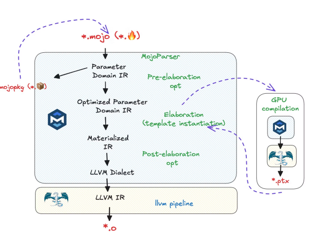

# A Comparison of different approaches to accelerating Python ML code

In this post we'll look into triton, pytorch, mojo, cupy and taichi. They all try to take a different approach to speeding up python code that's easy to develop, but won't perform well if executed using the cpython interpreter.

You can explore these approaches using different dimensions. In this post, let's explore them using the "CUDA moat" argument.

CUDA is Nvidia's flavor of a low level compiled language that's loosely based on C. It's the defacto standard for writing high performance kernels.

## How does CUDA work?

Nvidia ships a [toolchain](https://docs.nvidia.com/cuda/cuda-compiler-driver-nvcc/#the-cuda-compilation-trajectory) that includes a `nvcc` compiler wrapper. After some preprocessing, it produces a PTX binary which is a virtual retargetable instruction set that can run on many GPUs. It can also produce `cubin` targeting a particular generation (such as H100) or `fatbin` which could target multiple generations. This toolchain runs on top of existing Linux toolchains based on gcc/g++.

SASS is the low-level assembly language that compiles to binary microcode, which executes natively on a particular generation of NVIDIA GPU hardware.

## What are competitors doing?

Intel and AMD have been proposing approaches similar to Nvidia with a different branding ([SYCL](https://www.khronos.org/sycl/) and [HIP](https://github.com/ROCm/HIP)) and some differences in approach. They're not the focus of this post.

## Magical Decorators

The approach all of the tools take is very simple. The programmer first writes code, runs it on their laptop in some slow, easy to debug mode. Once correctness is verified, they add a "magical" docorator like so:

```
@makeitfast
def some_func()
    ...
```

These decorators receive the python abstract syntax tree (AST) as the input. They're free to rewrite it any way they like to produce machine code. In fact, this is the same approach transpilers like [py2many](http://github.com/py2many/py2many) use to generate source code for different compiled languages from python.

## LLVM Compiler Infra

Even though gcc has dominated open source compiler landscape for the first 25 years of its existence, it has refused to modularize the compiler infra for non-technical reasons. LLVM project has taken a different approach and exposed it's internals by documenting the intermediate representations. A key development in this space is called [MLIR](https://mlir.llvm.org/) which was published in 2020.

This idea is close to my heart because I got a B in my compiler class when I refused to use the IR that the teaching assistant wanted me to use, since it was uniquely unsuitable for the purpose. The cost of writing a new IR in a fixed period of time meant that while it worked for simple cases, it had bugs and would not pass the automated tests the TA had put in place.

MLIR recognizes that different problems require different IR dialects and makes it easy to write new domain specific IRs.

## Triton

Triton is a heavily overloaded name. There is the inference server that Nvidia ships, but it's also the name of a new programming model from [OpenAI](https://openai.com/index/triton/).

The triton toolchain uses:

```
python -> triton-ir -> llvm-ir -> PTX -> target 
```

In 2022, the triton project switched triton-ir to use the MLIR compiler infra. It now goes through a 3 stage triton-ir -> generic-gpu -> nvidia-gpu 

Key aspects of this approach: 

* Stick to python as a source language
* Use [block based abstractions](https://triton-lang.org/main/programming-guide/chapter-1/introduction.html#motivations) instead of SIMT (Single Instruction Multiple Threads) abstraction used by CUDA
* Use a `tl.arange`, `tl.load` and `tl.store` type of primitives to explicitly handle memory allocation/access vs the more natural approach used by numpy/scipy.

Excellent [3 part deep-dive](https://www.kapilsharma.dev/posts/deep-dive-into-triton-internals/) into the topic.

## torch.compile

This is probably the most popular way to speed up python code right now. The infra uses three stages:

* Dynamo: uses cpython's infra to capture a FX graph (function execution)
* AOTautograd: Performs automatic differentiation
* Inductor: backend. For GPUs it uses triton. You could bring your own.

## Mojo

Mojo is a closed source language with an open source stdlib that some of the founders of the LLVM projects are working on. As the MLIR website says: "we do not intend MLIR to be a source language that end-users would themselves write kernels in (analogous to CUDA C++)", we need some other language.

The authors of mojo have decided that python is insufficient and a more specialized language is needed and hence mojo.

Mojo borrows concepts from Rust ("borrow checker") for handling memory allocation and static types (which python3 also supports) in a stricter sense.

Being a superset of python, you can execute regular python code, but you can also write code in mojo native dialect that uses a MLIR based toolchain.

Based on various mojo [talks](https://www.youtube.com/watch?v=yuSBEXkjfEA) it looks like the pipeline is:



The part in blue is likely closed source and presumably includes multiple mojo dialects at various levels of abstraction.

Much of the infra seems to be implemented in C++, like the LLVM project itself.

There is an open question about whether a new dialect of source language (mojo) is needed or like other contenders covered here, we can stick with a subset of static python.

## cupy

cupy allows you to abstract many CPU/GPU/NPU abstractions into a common abstraction and write simple python code that can be lowered to target a specific device.

Instead of writing `np.foo()` (CPU) or `cp.foo()` (GPU), you can write `xp.foo()` and get it to run on both. This works only when APIs are standardized and not divergent.

At its core cupy takes a function-at-a-time just in time (JIT) transpiler [approach](https://github.com/cupy/cupy/blob/05c9ff2466ea0933e3a177d5ece2e885f2db1529/cupyx/jit/_compile.py#L192).

Allows you to do some kernel fusion via `cp.fuse()` and write inline `rawkernels` which use CUDA directly. This is similar to using SQL as strings inside python.

Overall, while cupy is nice from a end user perspective, it feels limited if you want raw performance to compete with CUDA.

## taichi

While the internals of taichi are similar to mojo (written in C++, SSA, multiple layers of IR) there are two major differences:

* Sticks to a subset of python and takes a decorator approach
* Doesn't use the LLVM MLIR infra

But by sticking to a subset of python, it unlocks potential that other JITs like pypy can't achieve because they strive for compatibility


More info about [internals](https://docs.taichi-lang.org/docs/internal)

## What is a kernel?

There has been some debate about this topic. The de-factor industry standard is what Nvidia's CUDA runtime can launch. Which is based on SIMT and Warps.

However, this definition is not universal and being reconsidered.

Taichi says any python function with `@ti.kernel` decorator is a kernel. While this is more intuitive from a programmer perspective, it doesn't match the ground reality today.

In order to build a new industry standard, we need to standardize on a programming model (e.g. tile/block based), a generic programming model (templates, blocks/grids) and a development environment that supports both eager/graph mode.

## Conclusion

Hopefully this provides a good overview of the landscape that involves multiple competitors trying to speed up python for ML purposes by leveraging existing compiler infra.
