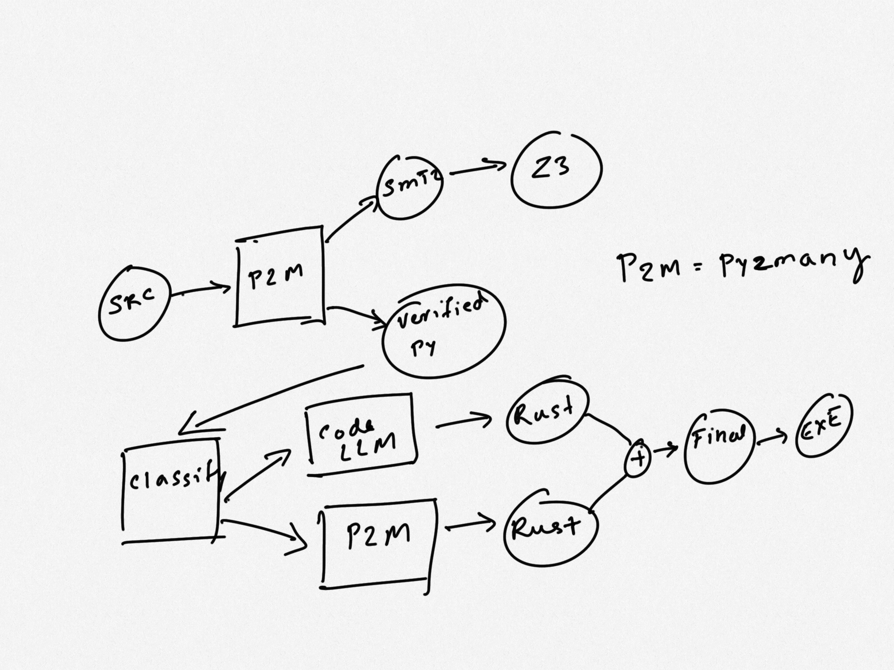

# Transpilers in the Emerging Agentic Era

As we transition from the Large Language Model (LLM) era to the agentic era, anticipated to unfold in 2025, a new architectural framework is taking shape. In this agentic landscape, compact language models serve as orchestrators, delegating tasks to specialized agents equipped with advanced models and the capacity for action, which then return results.

## Why care about transpilers?

We have a large amount of investment going into language design, AI code editors and integration with existing coding flows. While people may position these as massive changes, they may just be incremental changes or implausible claims, such as “English is the new programming language,” or the notion that this no-code platform will take over.

A more realistic expectation that results in sustainable innovation is an architecture where programmers move from imperative programming languages to precise specification languages. English is not exactly precise.

A second idea that has gotten some traction is the idea of cognitive load. Human brain has a limited capacity to process details. So use that capacity for important things and leave the rest to machines.

What does it mean for specification languages? It means what we can't lower it directly into assembly or byte code and get it work. What happens when things break? Who will debug and at what level of abstraction? Can a front end developer understand the rust borrow checker?

One answer to these questions is to use many intermediate layers at different levels of abstraction which are appropriate for the problem being debugged. Are you looking to solve a O(n**2) loop? Use python. Are you debugging memory leaks? May be use a lower layer. Is your CPU getting into thermal throttling because you used too many vector instructions? Perhaps look into EBPF or a systems programming language.

These ideas are not new. They're also quite prevalent in the [MLIR](https://mlir.llvm.org) community. They advocate for multiple-levels of intermediate represenations to perform different optimizations.

## Why not code in rust and get exactly what I want?

Because the level of detail presented by rust is more than what is required for some programming tasks. There is also a mismatch between human capacity to learn (how many people can be proficient in rust vs python/typescript?) and the ambition of some of these communities.

But once you get into a multi-language, MLIR approach to transpilation, having a capable language like rust (or any of the other contenders) would be a great value addition. We'll certainly want to solve as many memory leak problems at compile time as possible. The rust level of abstraction is the best intermediate level to solve these life time, memory leak problems.

## A blueprint for the future

Here's a proposal. Programmers write precise specifications using types in python3 and design by contract primitives. They execute this specification using a forked python language interpreter. Perhaps this will be called something else in the future. Humor me for now.

After some initial debugging, they hit the transpile and ship button.

As a first step, in high safety environments where verification is important, we could have an optional step of transpiling the specification into SMT2, a lisp-like language consumed by z3 SMT solver. This could be used for basic type checking (via [typpete](https://github.com/caterinaurban/Typpete)) or more advanced [design by contract techiques](https://adsharma.github.io/pysmt/).

Then the verified source code is fed into a model specialized to segment the code into sections where LLMs may perform better and other sections where a traditional transpiler is likely to perform better. This determination could be made based on factors such as:

* How security sensitive the code is
* Library API dependencies that don't translate cleanly
* Are we talking about a test harness or some idiomatic code that uses substantially different idioms in different languages?

In a third stage, an agent is going to look at the annotations in the code based on the determination above and send it to a traditional AST (abstract syntax tree) transformer such as py2many which produces code in the target language or send it off to a LLM which would increase the risk of incorrect code, but handle idioms and language dependencies better.

After these different segments are transpiled, they're merged by a build system in the target language, compiled into a binary and shipped to customers.

In this [hello-wuffs.py](https://github.com/py2many/py2many/blob/main/tests/cases/hello-wuffs.py) example code, we could use the transpiler for `class parser` and a code LLM for the rest of the code to translate `pytest` to `tokio::test`. The resulting code should be more robust/correct than using either approach by itself.

## Language Incompatibilities

While different IRs in MLIR are designed to co-exist, the languages we use in the transpiler evolved organically with different, sometimes incompatible design goals.  Some experimentation has shown that it's possible to effectively bridge them using some language design tricks.

### Exceptions vs Result[T]

The `hello-wuffs.py` example above is a demonstration of how python can adopt some rust features to make the transpiler more effective. Old python code using exceptions would have to be transpiled to fit this idea.

### Reference counting vs borrow checker

As the [bubble_sort.mojo](https://github.com/py2many/py2many/blob/main/tests/expected/bubble_sort.mojo) example shows, it's possible to statically analyze code and convert some reference counted parameters to use more advanced concepts such as owned references and borrows.

These are areas where mojo seems to have followed the rust design.

## But why fork python language spec?

The design goals of python include readability, being simple and easy to use while abstrating away low level details. These are often in conflict with writing a correct specification.

For example, python uses arbitrary precision signed integers extensively in the language. While you can annotate something as a `u32`, a fixed sized unsigned int, no comparision operations are possible in the u32 domain. So you can't be sure if there will be an overflow after you transpile.

Another reason is the dependency on C-API and much of stdlib being implemented in C. This is a compatibility trap which prevents innovation. I hope we arrive at a stdlib implementation using a dialect of python similar to what's discussed here.

Lastly python3.9 added a `match` statement that's incompatible with the direction taken by Rust and the C++ working group. They use `match` as an expression. While there may be valid reasons for this choice given python's design goals, they don't translate well when you try to lower python into these compiled languages. Also these new features are rarely used after 3 years of existence.

It's a non-goal to gratuitiously fork python and take the tremendous burden of keeping up with a much much larger community. So any deviation from cpython should be minimal and perhaps in collaboration with other like minded projects such as rust-python, [taichi](http://taichi-lang.org) and mojo.

## Conclusion

Many LLMs generate incorrect code, hallucinate unpredictably and could cause the programmer to spend more time debugging than its worth. We present a more robust, practical approach. On the downside, implementing this architecture can take many years.
