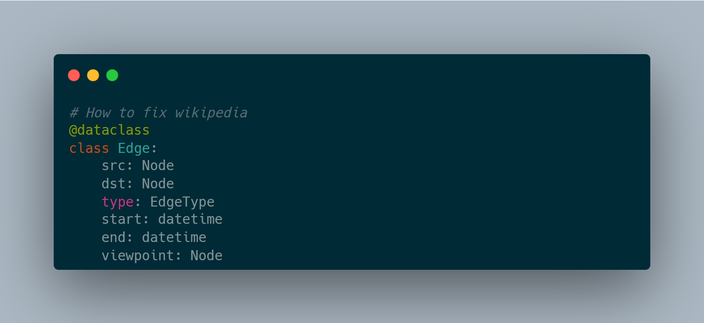

# A Universal Knowledge Graph Schema

I'll keep this one short. There have been a bunch of controversies around wikipedia and it's lack of viewpoint diversity and undue influence of state level actors, the rich and the powerful. Many LLMs have been trained on this data and continue to propagate what's written there and more importantly suppress what's NOT written there.

The most successful universal schema I'm aware of is the one used by Facebook [Tao](https://engineering.fb.com/2013/06/25/core-infra/tao-the-power-of-the-graph/). Very simple. Nodes and edges with a type, one timestamp and an optional small blob. This schema was duplicated by a number of similar systems in the NoSQL era.

However, this is insufficient to represent human knowledge in the Agentic era where concerns about the truthfulness of these models and copyright infringement have been some of the top concerns.

## Universal Knowledge Graph Schema

Here's an alternative to consider:



This is inspired by some of the blog posts I read recently. Instead of saying Delhi is the capital of India, we say it's the capital of India between the following dates. And that Kolkata was the capital when the East India company ruled India. For people with a different viewpoint, there may be another mythical city that's the capital for various political, religious and nationalistic reasons.

Instead of burying that in footnotes, the proposal here is to add it to the graph.

## What Exactly is a Viewpoint Node?

It'd be like any other node, but with a set of ground truths on what that viewpoint believes in. We'll attempt to do that without judgement and without using loaded language that would evoke a strong emotional response.

Examples:

* Globalist Capitalism: Supports globalization, free trade, and the free market, prioritizing economic growth and international cooperation.
* Socialism: Seeks to redistribute wealth and promote economic equality, often through government regulation and public ownership of key industries.
* Anti-Colonialism: Seeks to dismantle the legacies of colonialism, promoting self-determination, cultural preservation, and economic empowerment for formerly colonized communities.
* Techno-Utopianism: Envisions a future where technology solves many of humanity's problems, such as poverty, disease, and environmental degradation, often advocating for the use of advanced technologies like artificial intelligence and biotechnology to create a more equitable society.
* Communism: Aims to establish a classless, stateless society where resources are shared equally among citizens.
* Libertarianism: Advocates for minimal government intervention in personal and economic matters, emphasizing individual freedom and autonomy.
* Regligious Nationalism: Combines religious values with nationalistic sentiments, often promoting a strong sense of patriotism and traditional social norms.
* Anarchism: Rejects authoritarian structures, advocating for voluntary associations and the abolition of the state.
* Fascism: Emphasizes national unity, authoritarian leadership, and suppression of political opposition, often accompanied by racist or xenophobic ideologies.
* Green Politics: Prioritizes environmental sustainability, social justice, and grassroots democracy, often advocating for radical changes to capitalist systems.
* Conservatism: Seeks to preserve traditional values, institutions, and social hierarchies, often promoting limited government intervention in economic matters.
* Liberalism: Supports individual rights, freedoms, and social equality, often advocating for government intervention to address social and economic issues.

Each of these viewpoints would be explained from first principles. A viewer can combine several of these principles to create their own personal viewpoint.

## How will this affect the knowledge graph?

Instead of there being one source of truth like it is the case with wikipedia and wikidata, there would be many. A viewer can navigate the graph using their own preferred viewpoint.

You could actually see how a model answers questions designed to tease out the underlying moral principles like:

```
Reply with 1 word. Save 100 X or 1 Y from certain death.
```

There is even a [benchmark](https://github.com/agiresearch/moralbench) for things like this.

## But this leads to Conspiratorial Thinking!

Based on periodic national elections, we can offer an "averge/median" viewpoint that's a blend of what political scientists think is the case at any given point in time. A user can then set aside their personal biases and navigate the knowledge graph like an average French or Nigerian person would.

If there is a high level of conspiratorial thinking among the general population at a given point in space and time, that would be interesting to know as well!

## How do you implement this?

I think getting [wikidata](https://adsharma.github.io/explainable-ai/) into [duckdb](https://adsharma.github.io/duckdb-wikidata-compression/) could be a good start. Followed by knowledge distillation similar to how new models learn from "teacher models". In this case we'd be distilling viewpoint based data into a knowledge graph instead of another model.

This could solve some of the concerns about copyright infringement as well. Once all useful data has been extracted into publicly available knowledge graphs, copyright holders can file petitions to delete infringing content to the extent allowed by law. Over time, the previous generation tainted models with copyrighted content will become obsolete.

## Conclusion

Do consider getting in touch if you're interested in funding such an effort. Shouldn't be hard to look up my socials.