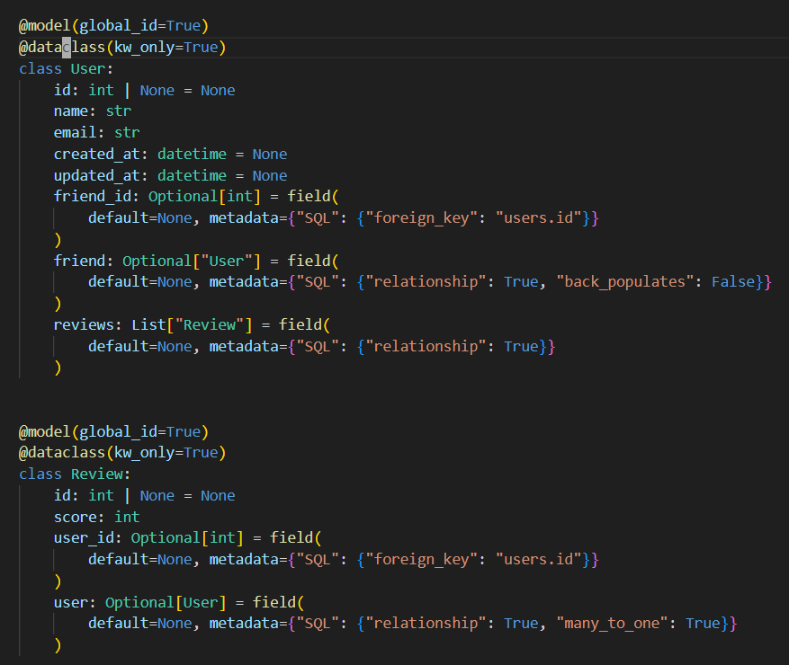
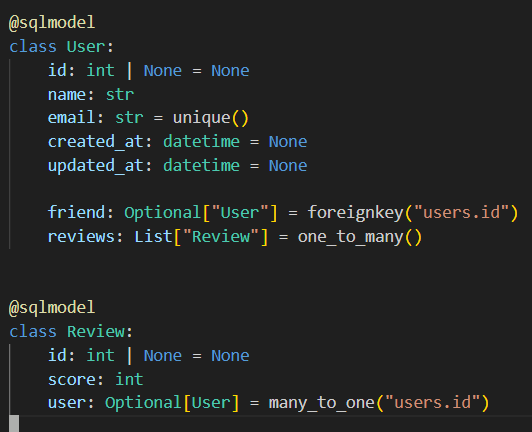

# Fquery meets SQLModel
Keep your Graphs and dataclasses and make them even more powerful with SQLModel and DuckDB!

Fquery [started](https://adsharma.github.io/fquery/) as a graph query engine for nested JSON objects (think jq) that's integrated into higher level programming languages with static types. The vision was to make it easy to extract a large application query and ship it to a backend optimizer for whole query optimization.

[SQLModel](https://sqlmodel.tiangolo.com/) is a popular ORM for python written by the author of FastAPI which builds on previous work by pydantic (runtime data validation library) and sqlalchemy (SQL toolkit and ORM).

In the upcoming 0.3 release, fquery seeks to integrate with relational databases by innovating along side SQLModel.

## What problems are we solving?

While some graph databases use [custom disk formats](https://neo4j.com/developer/kb/understanding-data-on-disk/), a more popular option is to store graphs in a relational database. Facebook stores the graph in MySQL and puts a transactional write through cache in the front. So does pinterest and many other industry paractitioners.

If you want to query neo4j's node store or property store, you have to use a custom language dialect as opposed to query engines optimized for columnar storage such as duckdb and more widely used dialects of SQL.

If you squint and look at the most optimzied storage layout [block format](https://neo4j.com/videos/nodes-2024-block-format-the-next-generation-graph-native-storage-engine/) in a graph database, the dense store looks like a B+ tree based table.

## Python Object Ecosystem

Python's object model has evolved over the years. Before 2018, you wrote code such as:

```python
class Point:
    def __init__(self, x, y, z):
        self._x = x
        self._y = y
        self._z = z
```

In python3.7, `dataclasses` were introduced. They allowed you to use a more compact decorator:

```python
@dataclass
class Point:
    x: int
    y: int
    z: int
```

Dataclasses have had their share of controversies over the years. Some people dislike them because they do too much "magic" behind the scenes such as overriding `__init__`, `__eq__` and a number of other builtin methods in ways that make it convenient, but hard to debug.

```shell
$ wc -l dataclasses.py 
    1630 dataclasses.py
```

There were also controversies around complexity, mutability, performance and compatibility with existing code. Some people refuse to use dataclasses for this reason and stick with either classic python objects or use pydantic.

```python
from pydantic import BaseModel

class Point(BaseModel):
    x: int
    y: int
    z: int
```

In fact, pydantic supports its own variant of `dataclassses` to make things more interesting.

So which one is better? That question is equivalent to asking if static type checking (favored by dataclasses) is better than runtime type checking (favored by pydantic). The answer is: it depends on the use case.

## Python's SQL and ORM Ecosystem

SQLAlchemy is a big player here. It's the oldest and most widely used library. Supports a number of databases. However, for someone new to programming languages, it can be overwhelming.

```python
from sqlalchemy import Column, Integer
from sqlalchemy.ext.declarative import declarative_base

Base = declarative_base()

class Point(Base):
    __tablename__ = 'points'

    x = Column(Integer, nullable=False)
    y = Column(Integer, nullable=False)
    z = Column(Integer, nullable=False)
```

Besides SQLModel, another prominent alternative is Django ORM. Although Django is a well-established project, SQLAlchemy's mindshare appears to be larger, particularly since it's widely used by other web frameworks like Flask and FastAPI. Interestingly, there are efforts to [integrate Django with SQLAlchemy](https://djangostars.com/blog/merging-django-orm-with-sqlalchemy-for-easier-data-analysis/), leveraging SQLAlchemy Core's [capabilities](https://medium.com/@noransaber685/getting-started-with-sqlalchemy-core-for-beginners-part2-5d8f9becad3f) to enhance data analysis, as seen in various examples.

## Enter SQLModel

[SQLModel](https://sqlmodel.tiangolo.com/), is a relatively new entrant. Here's a brief history

* October 2020: SQLModel 0.1.0 is released, providing basic support for SQLAlchemy models.
* December 2020: SQLModel 0.2.0 is released, adding support for relationships, foreign keys, and more.
* February 2021: SQLModel 0.3.0 is released, introducing support for async databases and improved performance.
* June 2021: SQLModel 0.4.0 is released, adding support for database migrations and more.

Since its initial release, SQLModel has gained popularity and is now widely used in the Python community, especially among FastAPI developers.

```python
from sqlmodel import SQLModel, Field, Integer


class Point(SQLModel, table=True):
    x: int = Field(sa_column=Column(Integer, nullable=False))
    y: int = Field(sa_column=Column(Integer, nullable=False))
    z: int = Field(sa_column=Column(Integer, nullable=False))
```

It brings the best of pydantic and SQLAlchemy in one easy to use package for python developers.

## Benchmarks

Using this [benchmark](https://github.com/adsharma/fquery/blob/main/tests/benchmark.py) I got the following data on my laptop:

Creation cost:

```
dataclass: 200ns
pydantic: 800ns
sqlmodel: 24ms
```

which makes sense, since pydantic has to do runtime validation of fields such as dates and email addresses and SQLModel has to do even more work to bridge it with SQLAlchemy.

## What is the Innovation here?

With the 0.3 release, fquery has a new decorator that works like this:

```python
from fquery.sqlmodel import sqlmodel

@sqlmodel
class Point:
    x: int
    y: int
    z: int
```

This is very close to the dataclass syntax, most modern python programmers are already familiar with. Fquery uses a [typemap](https://github.com/adsharma/fquery/blob/07efaa864e17ec7ae4e657da7078b4f25f25a60e/fquery/sqlmodel.py#L30-L39) to map python types to SQL types.

If you want more fine grained control, you can use dataclass `metadata` field to add additional constraints:

```python
class User:
    email: str = field(default=None, metadata={"SQL": {"unique": True}})
    ...
```

> **_NOTE:_**  We use `SQL` key to keep all the SQLAlchemy/SQLModel related metadata separate from any other metadata you may have in your dataclass.

This way you can have your cheap 200ns dataclasses and then when you need the power of pydantic and SQLModel, you can summon them on-demand.

## But.. I don't like the Syntax

Using the dataclass syntax makes things more verbose vs existing SQLModel syntax. But there is a solution that makes it much better. Here's an example.




A more realistic shopping website example with working integration tests.

[Before](https://github.com/adsharma/fastapi-shopping/blob/60065f56b14cc791d216d866618e890a8cd7b764/models.py) and [After](https://github.com/adsharma/fastapi-shopping/blob/9bc31efc945c5add834bcb8fe5cda158e6f8aaa2/models.py). Compare `Product` and `Order` examples.

## So Fquery becomes a SQL centric project now?

Not necessarily. Fquery can remain true to its graph query roots. In fact, I'm looking to enhance unit tests to support `pandas` and `graphistry`. 

```
import graphistry, pandas as pd

g1 = (graphistry
  .nodes(pd.read_csv('senators.csv'), 'id')
  .edges(pd.read_csv('relns.csv'), 's', 'd'))

g2 = g1.chain([
    n({“id”: “Schumer”}),
    e_forward(edge_query=“weight > 0.5”),
    n({“type”: “Senator”}),
    e_reverse(edge_query=“weight > 0.5”),
    n({“id”: “Pelosi”})
])
```

instead of the current json based examples.

## Fquery Core Principles

Continue to be a graph query engine, while integrating with Python's SQL/ORM ecosystems for graph storage. Towards this end, there is demo using fquery + SQLModel to build a RDF based knowledge graph [here](https://github.com/adsharma/truth-serum/blob/main/truth/kg.py). After running the demo, you get a [RDF graph](https://gist.github.com/adsharma/d9fb7264a26b2ce52e5dad775e9c9be6) in `duckdb`. 

The same approach can be trivially extended to support [Property Graphs](https://neo4j.com/blog/rdf-vs-property-graphs-knowledge-graphs/)

While SQLAlchemy sessions can support method chained queries with `filter`, `limit` and `order_by`, the moment nested objects are involved or you start using `join()` in your query, the object relational impedence mismatch kicks in and things fall apart.

Fquery will take a principled approach, extensive unit tests and lazy materialization to bridge the gap. Example code:

```python
        resp = (
            UserQuery([1])
            .edge("friends")
            .project(["age", ":id"])
            .parent()
            .edge("friends")
            .project(["name", ":id"])
            .take(3)
            .to_json()
            .send()
        )
```

will give you this [data](https://github.com/adsharma/fquery/blob/main/tests/test_data/test_data_two_hop_multiple_project.txt).

## Roadmap

While fquery supports translation to `SQL` (via [pypika](https://github.com/kayak/pypika) and SQLAlchemy) and other graph oriented languages such as GraphQL and Malloy, there is no query executor to demo the power of full query optimization in the backend. This would be a great next step.

Supporting [GQL](https://www.gqlstandards.org/) which is now an ISO standard, pandas like dataframe API, which is popular among data scientists are also interesting future directions. 


## Summary
Keep your Graphs and dataclasses and make them even more powerful with SQLModel and DuckDB!