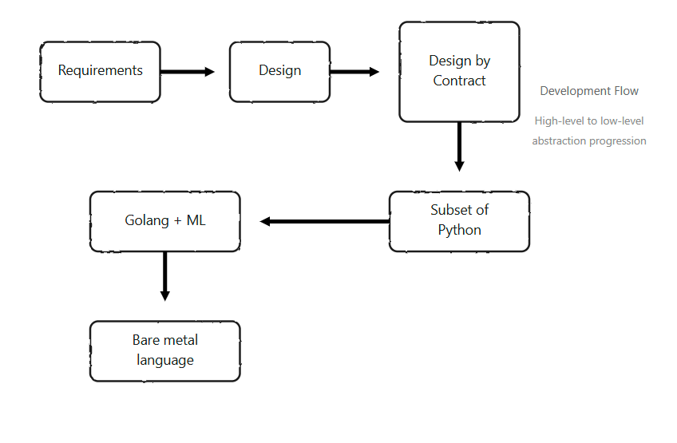

Programming is a deeply iterative thought process, requiring a blend of creativity, logic, and technical precision. However, not every programmer is equipped—or inclined—to wrestle with low-level languages like RISC-V assembly. The software development landscape is marked by a wide spectrum of skills, interests, and expertise. Some developers thrive on crafting user-facing applications, while others delve into systems programming or formal verification.

This diversity underscores a key challenge: how do we evolve programming languages and tools to meet varied needs in an era where artificial intelligence (AI) is reshaping how code is written? A diffusion model for programming—where high-level ideas are probabilistically expanded into working code—offers a path forward. Instead of inventing entirely new languages, we should enhance familiar ones, like Python and TypeScript, with features such as static typing and design by contract, while leveraging AI-driven build tools to gradually lower abstraction levels without sacrificing accessibility.

The advent of AI-assisted programming, where rough task descriptions are transformed into functional code, signals a shift in how we approach software development. Rather than creating new, specialized languages that require steep learning curves, we should evolve existing, widely adopted languages to accommodate this new paradigm. Python and TypeScript, two of the most popular languages today, are prime candidates. Python’s simplicity and readability make it a favorite for rapid prototyping and data science, while TypeScript’s type safety and scalability have cemented its dominance in front-end and full-stack development. 

By enhancing these languages with features traditionally associated with “ivory tower” concepts like formal verification and design by contract, we can bridge the gap between accessibility and robustness without alienating their user bases.

Fig 1: Diffusion Model for Programming

Formal verification and design by contract, which involve specifying and verifying program behavior through rigorous mathematical proofs or contracts, have historically been inaccessible to the average programmer. These techniques are often confined to critical systems, such as aerospace or medical software, where correctness is paramount. However, integrating lightweight versions of these concepts into Python and TypeScript could democratize their benefits. 

For example, Python could adopt optional static typing beyond its current type hints, enabling compile-time checks for critical code paths. Similarly, TypeScript could incorporate contract-based assertions, allowing developers to define invariants and preconditions directly in the code. These enhancements would empower developers to write more reliable software without requiring expertise in formal methods. Tools like `uv` and `pyrefly` for Python and TypeScript’s existing type system provide a foundation, but further integration of contract-based programming could make these languages more robust for AI-driven development.

A key component of this diffusion model is the evolution of build tools, which combine AI and traditional compilers to translate high-level ideas into efficient machine code as depicted in Fig 1.

Humans use natural language to discuss and convert requirements into design docs and an architecture. They then lower it into a more formal specification using techniques outlined in [Agentic Transpilers](https://adsharma.github.io/agentic-transpilers/).

The next step is to generate machine code directly, bypassing manual memory management, which is a significant barrier for many developers. AI can assist by analyzing high-level code and producing optimized low-level instructions, much like modern compilers but with greater flexibility and adaptability. For performance-critical applications, further lowering the abstraction level through full program analysis—potentially incorporating techniques like Rust’s borrow checker—can ensure memory safety and performance without requiring developers to master low-level programming. This gradual lowering of abstraction allows developers to work at their preferred level while still benefiting from AI-driven optimizations.

In contrast, virtual machines (VMs) like the Java Virtual Machine (JVM) present limitations in this model. Kotlin, a language heavily tied to the JVM, serves as a cautionary example. While Kotlin is popular for Android development due to its interoperability with Java and concise syntax, its use outside the JVM ecosystem—such as in native code targeting Apple platforms—has been constrained by half-hearted attempts at native compilation. Kotlin/Native, for instance, struggles to compete with Swift on iOS due to performance overheads and ecosystem fragmentation. Meanwhile, tools like uv, a fast Python package manager written in Rust, demonstrate the power of compiling to native code for performance-critical tasks. The Kotlin compiler could learn from uv’s success by prioritizing native code generation and optimizing for specific platforms, rather than relying on VMs that introduce unnecessary overhead.

This diffusion model emphasizes using the right tool for the task. Forcing front-end engineers, accustomed to TypeScript’s dynamic workflows, to learn Rust’s steep memory-management model is impractical. Similarly, expecting systems programmers to adopt high-level abstractions for performance-critical tasks ignores their need for control. By enhancing Python and TypeScript with static typing and design by contract, and pairing them with AI-driven build tools that gradually lower abstraction levels, we can cater to diverse skill sets and application needs. These tools can generate efficient machine code for general applications and apply advanced techniques like borrow checking for high-performance scenarios, all while preserving the familiarity of existing languages.

In summary, the diffusion model for programming leverages AI to transform rough ideas into working code, but its success hinges on evolving familiar languages and tools rather than inventing new ones. By integrating static typing and design by contract into Python and TypeScript, we can make robust programming practices accessible to a broader audience. AI-driven build tools can further bridge the gap between high-level code and low-level execution, avoiding the pitfalls of virtual machines like the JVM. Kotlin’s limited success outside the JVM highlights the importance of native code generation, as exemplified by the popularity of VM-free tools like `uv`. Ultimately, this approach respects the diversity of developers’ skills and interests, ensuring that the right tools are available for the task at hand—whether it’s crafting a user-facing app or optimizing a performance-critical system. By building on what developers already know, we can create a more inclusive, efficient, and powerful programming ecosystem.