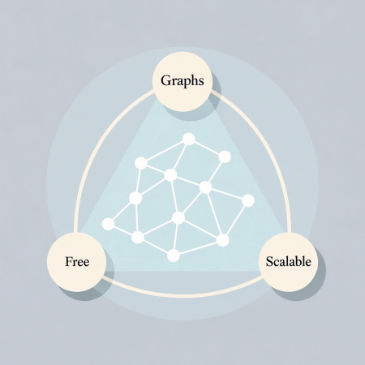
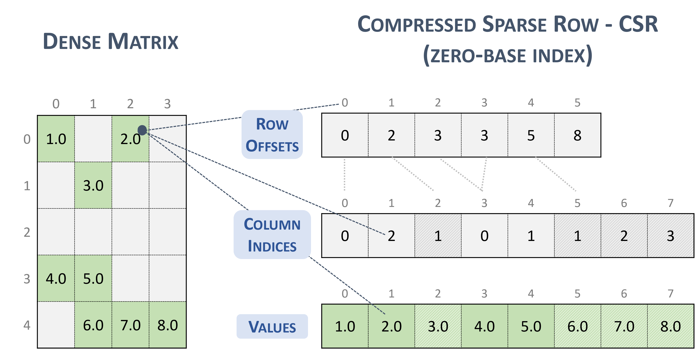

## Introduction

Graphs form the backbone of modern information retrieval and knowledge-based decision systems. Drawing from recent breakthroughs in large language models, we can now design storage systems with a fresh perspective. Doing so will require us to combine techniques from information theory, lossless compression algorithms with traditional database indexing. However, we face a fundamental challenge: CAP theorem for graph databases.


## What is the CAP theorem for Graphs?


[CAP theorem](https://en.wikipedia.org/wiki/CAP_theorem) is one of the pillars of distributed systems. It started as Brewer's conjecture, but was later proven by researchers at MIT, making it a theorem. The theorem states that any distributed storage system can provide only two of these three guarantees: ==C==onsistency, ==A==vailability and ==P==artition safety.

In the realm of graph databases, we observe a similar "two out three" situation. You can either have scalable systems that are not fully open source or you can have open source systems designed for small graphs. Details below.

In addition, there is the issue of obsolete, unmaintained technologies from previous decades. Wikimedia foundation for example stores its graphs in [BlazeGraph which is unmaintained](https://phabricator.wikimedia.org/T206560).

One of the key things graph advocates [tell you](https://x.com/arundsharma/status/1956213958756729278) is to store your data in scalable cloud based analytical systems, extract small summary graphs and visualize/query them using single file embedded storage databases such as DuckDB and Kuzu (tag line: DuckDB for Graphs).

## Is there a Parquet File for Graphs?

[Parquet](https://parquet.apache.org/) files stored on object storage have transformed the analytical database industry. The recent boom in the industry is responsible for at least a trillion dollars in market cap.

So why can't we have something similar for Graphs?

## Existing Standards

Turns out that there is such a thing as Parquet files for Graphs. They're called GraphFrames. They literally write Graphs as parquet files.

```
from graphframes import GraphFrame  
import pandas as pd  
...

vertices_pd = pd.DataFrame({  
"id": ["a", "b", "c"],  
"name": ["Alice", "Bob", "Charlie"],  
"age": [30, 35, 25]  
})  
edges_pd = pd.DataFrame({  
"src": ["a", "b", "c"],  
"dst": ["b", "c", "a"],  
"relationship": ["friends", "colleagues", "family"]  
})  
  
vertices_df = spark.createDataFrame(vertices_pd)  
edges_df = spark.createDataFrame(edges_pd)  
  
# 2. Create a GraphFrame  
g = GraphFrame(vertices_df, edges_df)  
  
g.vertices.write.mode("overwrite").parquet(vertices_output_path)  
g.edges.write.mode("overwrite").parquet(edges_output_path)
```
## Why aren't Graph Databases using them?

The most performant Graph databases use a different format internally. These are called Compressed Sparse Rows (CSR). 


*Fig 2: Original image courtesy of Nvidia [NVPL library](https://docs.nvidia.com/nvpl/latest/sparse/storage_format/sparse_matrix.html)*

This format has a big benefit over the 3 columns format stored in GraphFrames. It allows for much more efficient scanning of adjacency lists, which is a critical operation for graph traversal. They play a role similar to B+-tree indices used in join algorithms in relational databases.

## Limitations of existing storage formats

We will examine two storage engines. DuckDB's [duckpgq extension](https://duckpgq.org/) and Kuzu. DuckDB retains its columnar storage formats optimized for SQL and creates CSR data structures on the fly and in-memory. Details in Figure 1 and Listing 1 in DuckPGQ [paper](https://www.cidrdb.org/cidr2023/papers/p66-wolde.pdf).

Kuzu on the other hand uses CSR natively in storage. However when you import a graph from parquet to Kuzu native storage, there is a [21x increase in size](https://github.com/kuzudb/kuzu/issues/5743). With some optimizations, it could be reduced to 10x. I suspect Kuzu optimizes for some metric other than bytes on disk.


## A New Graph Storage Format

The idea is mainly targeted at large billion-scale read-only graphs. Store CSR data structures in multiple parquet files described by some metadata. Think of table formats such as Apache Iceberg or Delta Lake specialized for graph storage.

The famous [Zachary's karate club](https://en.wikipedia.org/wiki/Zachary%27s_karate_club) graph, intentionally generated with randomized ids looks like this.

```
$ ls karate_csr
karate_random_metadata.parquet
karate_random_nodes.parquet
karate_random_node_mapping.parquet
karate_random_indices.parquet
karate_random_indptr.parquet
```

| File                               | Purpose            | Notes                                                                  |
| ---------------------------------- | ------------------ | ---------------------------------------------------------------------- |
| karate_random_metadata.parquet     | Store Metadata     | Number of nodes, edges, format                                         |
| karate_random_nodes.parquet        | Node Storage       | Each node should have an id column and any additional property columns |
| karate_random_node_mapping.parquet | ID Mapping         | Node IDs are mapped to a dense zero based ID range as required by CSR  |
| karate_random_indices.parquet      | Column Indices     | Refer to Fig 2 for example                                             |
| karate_random_indptr.parquet       | Row Offsets/IndPtr | Refer to Fig 2 for example                                             |

To traverse the adjacency list of node N, we would map its ID using `node_mapping.parquet` to a dense space and then use it to index `indptr.parquet`. Two elements (`start_index` and `end_index`) are read at this offset. The first offset (`start_index`) is used to index `indices.parquet` and scan elements until you hit `end_index`.

If you prefer a single file version of this, the most convenient storage method is a duckdb file containing the tables above. A simple package with tools to generate graphs, convert them to CSR using duckdb as a tool and exporting to parquet are available on [github](https://github.com/adsharma/graph-std/).

## Cypher Syntax

Here's a reference implementation of the proposal that vendors can use to build more performant query engines. Even though we use cypher in this example, other graph query languages such as GQL and PGQ could work similarly.

```
CREATE NODE TABLE Person(ID INT64, name STRING, PRIMARY KEY(ID))
WITH (storage = '/tmp/karate_random');

CREATE REL TABLE knows(FROM Person TO Person, weight DOUBLE)
WITH (storage = '/tmp/karate_random');

MATCH (p1:Person)-[r:knows]->(p2:Person) RETURN p1.ID, p2.ID, r.weight;
```
## Conclusion

This is one solution to the CAP theorem for graphs. We can store a billion scale graph using this method in parquet files and use a free, cheap and open source solution to traverse them, perform joins without storage costs that are prohibitively high.

We hope more vendors will adopt this format and a rich ecosystem will develop around query engines for graphs stored on object storage.

Why this unlocks new innovations in a subsequent blog post. Stay tuned!
